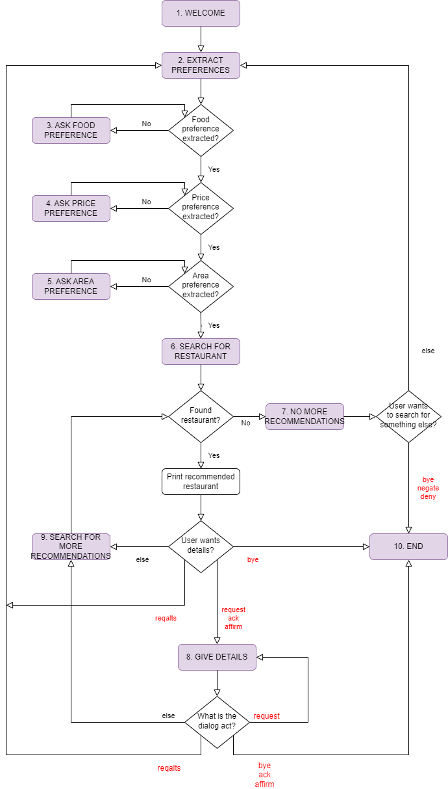
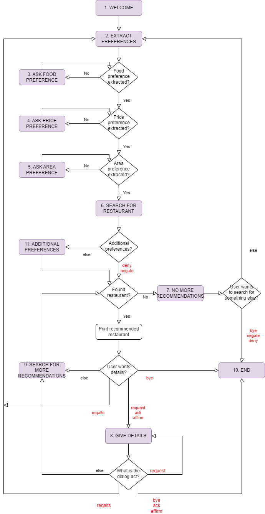

# Restaurant-Recommendations-Dialog-System
This is a restaurant recommendations dialog system.

## Table of Contents

- [Installation Requirements](#installation-requirements)
- [Data](#data)
- [Part 1A](#part-1a)
- [Part 1B](#part-1b)
- [Part 1C](#part-1c)
- [Example Dialog](#example-dialog)

## Installation Requirements

To run this project, you need to have **Python 3.x** installed on your machine.

The following packages are required:
- **pandas**: For data manipulation and analysis.
- **sklearn**: For machine learning models.
- **matplotlib**: For plotting graphs and visualizations.
- **Levenshtein**: For calculating Levenshtein distance.

## Data

The dataset (dialog_acts.dat) has the following format: **dialog_act [space] utterance_content** and is used to train models for dialog act classification.

There are 15 dialog acts in the dataset, listed in the following table:
| Dialog Act | Description                                      | Example Sentence                                |
|------------|--------------------------------------------------|-------------------------------------------------|
| ack        | Acknowledgment                                   | okay um                                         |
| affirm     | Positive confirmation                            | yes right                                       |
| bye        | Greeting at the end of the dialog                | see you good bye                                |
| confirm    | Check if given information confirms to query     | is it in the center of town                     |
| deny       | Reject system suggestion                         | I don't want Vietnamese food                    |
| hello      | Greeting at the start of the dialog              | hi I want a restaurant                          |
| inform     | State a preference or other information          | I'm looking for a restaurant that serves seafood|
| negate     | Negation                                         | no in any area                                  |
| null       | Noise or utterance without content               | cough                                           |
| repeat     | Ask for repetition                               | can you repeat that                             |
| reqalts    | Request alternative suggestions                  | how about Korean food                           |
| reqmore    | Request more suggestions                         | more                                            |
| request    | Ask for information                              | what is the post code                           |
| restart    | Attempt to restart the dialog                    | okay start over                                 |
| thankyou   | Express thanks                                   | thank you good bye                              |

## Part 1A
The program (part1A.py) provides the following options in the terminal:
```
1. Print evaluation metrics
2. Give an utterance for prediction
3. Exit
```

The following four models are trained for dialog act classification:
- **Majority-Label Model**: This model predicts the most common label in the training data for all inputs.
- **Rule-Based Model**: This model uses predefined rules to classify utterances based on keywords.
- **Decision Tree Model**: This is a decision tree machine learning model implemented using sklearn.
- **Logistic Regression Model**: This is a logistic regression machine learning model implemented using sklearn.

If the user chooses the first option, the program print the evaluation metrics for these models.

If the user chooses the second option, the user can enter an utterance and the system provides two dialog act classifications of this utterance based on the decision tree and the logistic regression model respectively.

For example:
```
Enter an utterance (or type '0' to go to menu): i want to find a restaurant
Predicted Label (Decision Tree): inform
Predicted Label (Logistic Regression): inform
```

## Part 1B
This part of the project (part1B.py) consists of modeling and implementing a dialog management system for restaurant recommendations.

The restaurant_info.csv file contains information for various restaurants with the following features:
- **restaurant name**
- **price range** (moderate / expensive / cheap)
- **area** (north / south / east / west / centre)
- **food**
- **phone**
- **address**
- **postcode**

The state diagram for this part of the project is the following:



The system asks the user which model to use for dialog act classification (Linear Regression Model / Decision Tree Model / Rule Based Model).

Then the conversation starts.

## Part 1C
This part of the project (part1C.py) extends part1B.py by adding a simple reasoning component and some congigurabilities.

More specifically, the following features (columns) are added to the DataFrame that contains the restaurant information:
- **food quality** (good / bad)
- **crowdedness** (busy / quiet)
- **length of stay** (long / short)
- **touristic** (0 / 1)
- **assigned seats** (0 / 1)
- **children** (0 / 1)
- **romantic** (0 / 1)

The following inference rules are utilized to determine additional restaurant properties based on the initial input:

| ID | Antecedent              | Consequent     | True/False | Description                                                                   |
|----|-------------------------|----------------|------------|-------------------------------------------------------------------------------|
| 1  | cheap AND good food     | touristic      | True       | A cheap restaurant with good food attracts tourists.                          |
| 2  | romanian                | touristic      | False      | Romanian cuisine is often unknown to most tourists, who prefer familiar food. |
| 3  | busy                    | assigned seats | True       | In a busy restaurant, the waiter typically decides where you sit.             |
| 4  | long stay               | children       | False      | Spending a long time in a restaurant is not advised when dining with children.|
| 5  | busy                    | romantic       | False      | A busy restaurant atmosphere is generally not considered romantic.            |
| 6  | long stay               | romantic       | True       | Spending a long time in a restaurant can create a romantic atmosphere.        |

The "11. ADDITIONAL PREFERENCES STATE" is added, extending the previous diagram:



We implemented the following configurabilities building upon part1B.py:
1. Use one of the baselines for dialog act recognition instead of the machine learning classifier.
2. Levenshtein edit distance for preference extraction.
3. Introduce a delay before showing system responses.
4. Allow users to change their preferences or not.

Another feature we added was to allow preferences to be stated in a single utterance only. It is not configurable as it is integrated into the state diagram, but we feel it improves the experience of interacting with the system.

The system asks the user which model to use for dialog act classification (Linear Regression Model / Decision Tree Model / Rule Based Model).

Then the system asks for the Levenshtein distance threshold (valid range [0,3]).

Then the system asks if the user want a small delay in the system responses so that the conversation feels more natural.

After having extracted the user preferences, the conversation starts.

## Example Dialog
```
Options:
1. Linear Regression Model
2. Decision Tree Model
3. Rule Based Model

Enter your model choice (1/2/3).
>>3

Set Levenshtein distance threshold for preference extraction.
(Enter '1', '2', '3' or '0' to ignore Levenshtein distance).
>>2

Do you want a short delay before showing system responses?
('1' for Yes, '0' for No)
>>0

Starting conversation...

Hello, welcome to the restaurant recommendations dialogue system!
You can ask for restaurants by area, price range, or food type.
>>Hello, I want a birtish restaurant at any area.
What price range do you want?
>>Whatever price.
Ok, I am searching for a restaurant based on the following preferences:
british restaurant at any price in any area...
I found  10  restaurants based on your preferences.
Do you have additional requirements?
>>Yes, I want it to be romantic.
Ok, searching with romantic as additional preference...
I found  2  restaurants based on your additional preferences.
fitzbillies restaurant is a nice restaurant serving british food.
Do you want details for this restaurant?
>>Yes.
What details do you want?
>>I want the address.
The address is 51 trumpington street city centre.
>>Can you also give me the phone number?
The phone number is 01223 352500.
>>Do you have any other recommendations?
the cambridge chop house is another nice restaurant serving british food.
Do you want details for this restaurant?
>>No, thanks.
There are no more restaurants to recommend. Do you want something else?
>>No, bye.
I hope I was helpful, goodbye!
```

